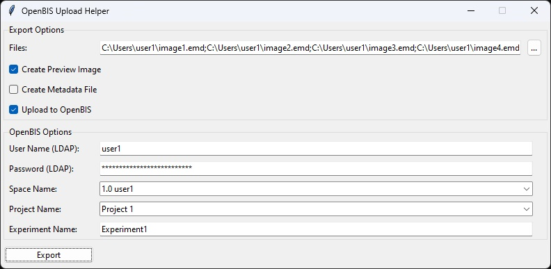

# OpenBIS Upload Helper

A simple upload tool for [OpenBIS](https://openbis.ch/) that parses metadata from the specified files, creates a preview of the data, and uploads the files and preview images along with the metadata to `OpenBIS`.

The structure of the metadata and some upload settings are specific to the `OpenBIS` instance used at [BAM](https://www.bam.de) and the [BAM Data Store](https://www.bam.de/Content/DE/Projekte/laufend/BAM-Data-Store/bam-data-store.html). 



## Folder Structure
- **Main Folder:** The Python Code for the Graphical User Interface, files specifying the requirements and license, and this readme file
- **Parser:** Collection of classes for parsing metadata from different files (a list of currently implemented parsers can be found [here](#parsers-that-are-currently-implemented))
- **Documentation:** Additional resources used in this documentation

## Installation:
Clone (or download) the repository, set up and activate a virtual environment, and install the packages from `requirements.txt`. For Windows:
```commandline
git clone https://github.com/BAMresearch/openbis-upload-helper
cd openbis-upload-helper
python -m venv .\venv
venv\Scripts\activate
pip install -r requirements.txt
```

## How to run:
After installation, the program can be run by simply double-clicking the `OpenBISUploadHelper.bat` file (on Windows), or by activating the virtual environment and running the script from the command line. For Windows:
```commandline
cd OpenBIS_Upload_Helper
venv\Scripts\activate
python OpenBISUploadHelper.py
```

## How to use:
- Select the file(s) you want to upload by clicking on the three dots `...` next to the text field for `Files`
- You can select whether you want to create a `Preview Image` (selected by default), create a `Metadata File` (disabled by default), and upload everything to `OpenBIS` (selected by default). If you select the second option, the parsed metadata will be written to a file (you can use this option and disable the upload if you are only interested in extracting metadata with the parsers).
- Enter your User Name. The script can be configured to automatically select the default Space Name and Project Name for this user (see source code for an example)
- Enter your Password (will be hidden with `*` characters)
- Select the `Space Name` from the dropdown list (or type it into the field)
- Select the `Project Name` from the dropdown list (or type it into the field)
- Give the `Experiment Name` to which these files belong
- Click on `Export`

This will automatically create a new `Experimental Step` matching the type of characterization data you selected in the specified `Experiment` of the `Prject` in the `Space` selected above. If the `Experiment` does not exist, it will be created automatically. The program will then attempt to find the right parser to use with these data, extract the metadata, create a preview image and/or metadata file (if the corresponding options were selected above), and upload everything to `OpenBIS`, filling the metadata fields of the `Experimental Step` accordingly. The program can also be configured to automatically set the `parents` for this `Experimental Step` to the corresponding `Instrument` from the `OpenBIS Inventory` (see source code for an example)   

## Parsers that are currently implemented:
- **Infrared Spectroscopy Data**, exported as csv from ThermoFischer Scientific OMNIC Software
- **Nuclear Magnetic Resonance Spectroscopy Data**, saved as JCAMP-DX files by Oxford Instruments SpinFlow Software for the XPulse instrument
- **Scanning Electron Microscopy Image Data**, saved as tif files by the Software of the Zeiss Supra 40 SEM
- **Transmission Electron Microscopy Image Data**:
  - Saved as tif files by the Software of the ThermoFisher Scientific Talos F200S 
  - Saved as emd files by the Software of the ThermoFisher Scientific Talos F200S
  - Saved as dm3 files by the Software of the JEOL JEM-2200FS TEM
- **Optical Spectroscopy Data**, exported as txt from the SoftMax Pro Software of the MolecularDevices Spectramax Platereader 
- **Dynamic Light Scattering data**, exported as csv from Malvern Zetasizer Instruments (Legacy) - For export from SQL Databases of the current Software, see [here](https://github.com/BAMresearch/MAPz_at_BAM/blob/main/Minerva/Hardware/OtherHardware/MalvernPanalytical.py) 

## License:
- The code for the Upload Helper Tool and the parsers are published under the [MIT license](https://opensource.org/license/mit).
- The code for parsing DM3 files is a slightly modified version of the code from Pierre-Ivan Raynal, published on [Github](https://github.com/piraynal/pyDM3reader) under the [MIT license](https://opensource.org/license/mit).
- The meta- and master-data schemata the parsers produce after extracting the metadata are Copyright (C) by the authors, all rights reserved.
